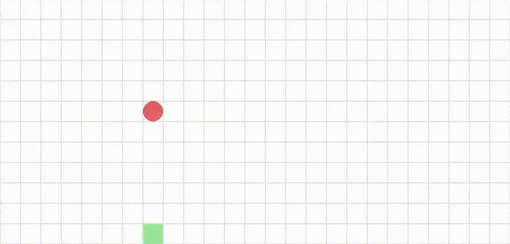

# snake-evolution
In this project the NEAT-Algorithm for Neuroevolution is used to create artificial neural networks. These networks can be used by agents to play the game Snake. 

Here is an example agent, that uses a trained network to play the game:
